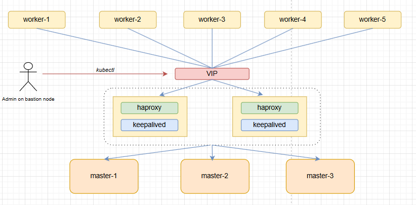

# 建置 HA cluster

## 目錄

* [HA cluster 概述](#ha-cluster-概述)

* [規劃 HA cluster](#規劃-ha-cluster)
  * [一、Load balancing master node](#一load-balancing-master-node)
  * [二、Infrastructure](#二infrastructure)
  * [三、Container Runtime & CNI](#三container-runtime--cni)

* [建置 HA cluster](#建置-ha-cluster)
  * [Step 1：建置 VM & 設定 IP](#step-1建置-vm--設定-ip)
  * [Step 2：安裝 SSH](#step-2安裝-ssh)
  * [Step 3：設定跳板機 (bastion)](#step-3設定跳板機-bastion)
  * [Step 4：設定 haproxy server & keepalived](#step-4設定-haproxy-server--keepalived)
  * [Step 5：檢查 keepalived 是否正常運作](#step-5檢查-keepalived-是否正常運作)
  * [Step 6：安裝 & 設定 Container Runtime](#step-6安裝--設定-container-runtime)
  * [Step 7：啟用必要模組 & 關閉 swap](#step-7啟用必要模組--關閉-swap)
  * [Step 8：安裝 kubeadm、kubelet、kubectl](#step-8安裝-kubeadmkubeletkubectl)
  * [Step 9：初始化 Master node](#step-9初始化-master-node)
  * [Step 10：安裝 CNI](#step-10安裝-cni)
  * [Step 11：加入其他 Master node](#step-11加入其他-master-node)
  * [Step 12：加入 Worker node](#step-12加入-worker-node)
  * [Step 13：檢查 HA cluster](#step-13設定-bastion-的-kubectl)


## HA cluster 概述

若 k8s cluster 中只有一個 master node (controlplane)，當 master 發生單點故障時將會導致 cluster 無法正常運做，因此在實務上會將 master node 的數量設定為 3 或 5 個，而這樣的 cluster 就稱為 HA cluster (High Availability Cluster)。

> 更詳細的介紹可以參考基礎篇的[【Basic Concept】：Kubernetes 的架構與組件](https://github.com/michaelchen1225/CKA-note/blob/main/CH1-to-6/01-Basic-Concept/Day%2002%20-%E3%80%90Basic%20Concept%E3%80%91%EF%BC%9AKubernetes%20%E7%9A%84%E6%9E%B6%E6%A7%8B%E8%88%87%E7%B5%84%E4%BB%B6.md#ha-cluster)

底下我們會實際建置一個 HA cluster，不過在實際動手之前，先簡單的規劃一下：

## 規劃 HA cluster

### 一、Load balancing master node

我們知道 kube-apiserver 是 master node 上的重要組件，任何訊息的傳遞都得經過 kube-apiserver。在 HA cluster 的架構下有多台 master，也就意味著有多個 kube-apiserver，這時候就需要一個負載平衡器 (Load Balancer) 來將請求分配到不同的 kube-apiserver 上。

在這次的建置中，會使用 `HAPrxoy` + `Keepalived` 的組合來實現 load balancing master node 的功能，運作方式如下：

* 使用 HAproxy 提供負載平衡的功能，將流量分配到不同的 master node 上。

* 為防止 HAproxy 出現單點故障，會使用兩台 HAproxy server，兩者皆會安裝 `Keepalived`。
  * Keepalived 會管理一個虛擬 IP (VIP)，該虛擬 IP 會隨機綁定到某台 HAproxy server 上。當其中一台 HAproxy server 故障時，另一台 HAproxy server 會自動接管該虛擬 IP，並繼續提供服務。

  * 由此可知，當有流量想要進入 master node 時，會先抵達 VIP，然後由 HAproxy 將流量分配到不同的 master node ：

    

    > 對於使用者 or 其他 node 來說，master node 的 IP 其實只是 HAproxy 的 VIP。流量抵達 VIP 後，HAproxy 會將流量轉發到 master node 上的 kube-apiserver。


### 二、Infrastructure

你可以用任意的平台來模擬出多個 VM，用來建置 HA cluster。以上圖 `haproxy + keepalived` 的組合來說，VM 的數量需求如下：

* 1 台 VM 作為跳板機 (bastion)：日後我們不會直接到 master node 上操作 kubectl 等指令，而是會透過跳板機來操作。

* **至少** 3 台 VM 作為 master node

* **至少** 2 台 VM 作為 HAproxy server。
  * 若手頭資源有限，也可以將 HAproxy & Keepalived 安裝在 master node 上，直接省去兩台 VM 的需求。

* **至少** 1 台 VM 作為 worker node。


在 IP 的規劃上，所有 VM 與 VIP 的需要在同一個 subnet 中，範例如下：

| 名稱 | IP 位址 | 
| ------- | ------- |
| VIP | 10.1.0.15 |
| bastion | 10.1.0.4 |
| haproxy-1 | 10.1.0.5 |
| haproxy-2 | 10.1.0.6 |
| master-1 | 10.1.0.7 |
| master-2 | 10.1.0.8 |
| master-3 | 10.1.0.9 |
| worker-1 | 10.1.0.10 |
| worker-2 | 10.1.0.11 |
| worker-3 | 10.1.0.12 |
| worker-4 | 10.1.0.13 |
| worker-5 | 10.1.0.14 |

### 三、Container Runtime & CNI

* Container Runtime：**containerd**

* CNI：**calico**
  * pod network CIDR：10.244.0.0/16

---

OK，這樣就規劃的差不多了，接下來我們就直接開始建置 HA cluster 吧！

## 建置 HA cluster

### Step 1：建置 VM & 設定 IP

這個部分就不再贅述了，大家可以自行挑選熟悉的方式來建置 VM，並設定好 IP。

* 每台 VM 都要能連到 Internet，這樣在安裝套件時會比較方便。

  > 以 VirtulBox 為例，最簡單的方式就是每台 VM 給兩張網卡，一張 NAT 用來連外網，另一張選橋接用來連內網(內網 IP 就是上面規劃的 IP)。

* VM 的最低配置可參考[官網](https://kubernetes.io/docs/setup/production-environment/tools/kubeadm/install-kubeadm/#before-you-begin)


### Step 2：安裝 SSH 

> 在**每台** VM 上都安裝 ssh，以利後續操作：

* 安裝 ssh：

  ```bash
  sudo apt-get update
  sudo apt-get install -y openssh-server openssh-client
  ```

* 啟動 ssh、設定開機啟動、檢查狀態：

  ```bash
  sudo systectl start ssh
  sudo systemctl enable ssh
  sudo systemctl status ssh
  ```

### Step 3：設定跳板機 (bastion)

為了後續操作與管理方便，我們會從跳板機上用 ssh 連到其他 VM 上進行操作，因此需要在**跳板機**上設定好 ssh 與 /etc/hosts：

> 在 **bastion** 上進行以下操作：

* 設定 /etc/hosts，將 VM 名稱與 IP 對應起來：
  
  ```bash
  # /etc/hosts
  127.0.0.1       localhost
  127.0.1.1       bastion

  10.1.0.5 haproxy-1
  10.1.0.6 haproxy-2

  10.1.0.7 master-1
  10.1.0.8 master-2
  10.1.0.9 master-3
  
  10.1.0.10 worker-1
  10.1.0.11 worker-2
  10.1.0.12 worker-3
  10.1.0.13 worker-4
  10.1.0.14 worker-5
  ```

* 生成 ssh key：

  ```bash
  ssh-keygen
  # 一直按 Enter 即可
  ```

* 將 ssh key 複製到其他 VM 上，以後就不用輸入密碼即可從跳板機 ssh 到其他 VM：

  ```bash
  ssh-copy-id haproxy-1
  ssh-copy-id haproxy-2
  ssh-copy-id master-1
  ...
  ...(省略)
  ssh-copy-id worker-5
  ```

* 以上步驟完成後，可以自行 ssh 到其他 VM 上測試一下：

  ```bash
  ssh haproxy-1
  ```

### Step 4：設定 haproxy server & keepalived

> 在 **haproxy-1** 與 **haproxy-2** 上進行以下操作：

* 安裝 haproxy & keepalived：

  ```bash
  sudo apt-get update
  sudo apt install keepalived haproxy psmisc -y
  ```

* 編輯 `/etc/haproxy/haproxy.cfg`，設定 haproxy 的負載平衡。需要設定的地方為「frontend」與「backend」：

  > 兩台 haproxy server 的設定檔都一樣，請在兩台 VM 上都使用相同配置：

  ```bash
  # /etc/haproxy/haproxy.cfg
  global
  ...
  ...
  ...(省略)
  ...
  defaults
  ...
  ...
  ...(省略)
  ...
  
  frontend kube-apiserver 
    bind *:6443
    mode tcp
    option tcplog
    default_backend kube-apiserver
  
  backend kube-apiserver
      mode tcp
      option tcplog
      option tcp-check
      balance roundrobin
      default-server inter 10s downinter 5s rise 2 fall 2 slowstart 60s maxconn 250 maxqueue 256 weight 100
      server kube-apiserver-1 10.1.0.7:6443 check # 替換 IP 為你自己的 <master-1>:6443
      server kube-apiserver-2 10.1.0.8:6443 check # 替換 IP 為你自己的 <master-2>:6443
      server kube-apiserver-3 10.1.0.9:6443 check # 替換 IP 為你自己的 <master-3>:6443
  ```

* 重啟 haproxy，並設定開機啟動：

  ```bash
  sudo systemctl restart haproxy
    sudo systemctl enable haproxy
  ```

* 接下來設定 keepalived，編輯 `/etc/keepalived/keepalived.conf`：

  > 兩台 haproxy server 的設定檔**不一樣**，差別在 `unicast_src_ip` 與 `unicast_peer` 的 IP 位址：

  ```bash 
  # haproxy-1
  # /etc/keepalived/keepalived.conf
  global_defs {
  
    notification_email {
  
    }
  
    router_id LVS_DEVEL
  
    vrrp_skip_check_adv_addr
  
    vrrp_garp_interval 0
  
    vrrp_gna_interval 0
  
  }
  
  
  
  vrrp_script chk_haproxy {
  
    script "killall -0 haproxy"
  
    interval 2
  
    weight 2
  
  }
  
  
  
  vrrp_instance haproxy-vip {
  
    state BACKUP
  
    priority 100
  
    interface eth0  # 替換成自己的網卡名稱，可用 ifconfig 查詢
  
    virtual_router_id 60
  
    advert_int 1
  
    authentication {
  
      auth_type PASS
  
      auth_pass 1111
  
    }
  
    unicast_src_ip 10.1.0.5 # haproxy-1 的 IP
  
    unicast_peer {
  
      10.1.0.6     # haproxy-2 的 IP
  
    }
  
  
  
    virtual_ipaddress {
  
      10.1.0.15/24    # VIP
  
    }
  
  
  
    track_script {
  
      chk_haproxy
  
    }
  
  }
  ```

  ```bash
  # haproxy-1
  # /etc/keepalived/keepalived.conf
  global_defs {
  
    notification_email {
  
    }
  
    router_id LVS_DEVEL
  
    vrrp_skip_check_adv_addr
  
    vrrp_garp_interval 0
  
    vrrp_gna_interval 0
  
  }
  
  
  
  vrrp_script chk_haproxy {
  
    script "killall -0 haproxy"
  
    interval 2
  
    weight 2
  
  }
  
  
  
  vrrp_instance haproxy-vip {
  
    state BACKUP
  
    priority 100
  
    interface eth0  # 替換成自己的網卡名稱，可用 ifconfig 查詢
  
    virtual_router_id 60
  
    advert_int 1
  
    authentication {
  
      auth_type PASS
  
      auth_pass 1111
  
    }
  
    unicast_src_ip 10.1.0.6 # haproxy-2 的 IP
  
    unicast_peer {
  
      10.1.0.5     # haproxy-1 的 IP
  
    }
  
  
  
    virtual_ipaddress {
  
      10.1.0.15/24    # VIP
  
    }
  
  
  
    track_script {
  
      chk_haproxy
  
    }
  
  }
  ```

* 重啟 keepalived，並設定開機啟動：

  ```bash
  sudo systemctl restart keepalived
  sudo systemctl enable keepalived
  ```

### Step 5：檢查 keepalived 是否正常運作

* 首先，在 bastion 上檢查 VIP 對應的網卡卡號：

  ```bash
  arp -n 10.1.0.15
  ```
  ```text
  Address                  HWtype  HWaddress           Flags Mask            Iface
  10.1.0.15                ether   7e:00:45:91:81:52   C                     eth0
  ```

* 透過網卡卡號，可以知道目前 VIP 綁在 haproxy-1 上：

  ```bash
  ssh haproxy-1 -- ip a | grep 7e:00:45:91:81:52 -A 5
  ```

  ```text
  link/ether 7e:00:45:91:81:52 brd ff:ff:ff:ff:ff:ff
  inet 10.1.0.5/24 brd 10.1.0.255 scope global dynamic noprefixroute eth0
     valid_lft 594390sec preferred_lft 594390sec
  inet 10.1.0.15/24 scope global secondary eth0
     valid_lft forever preferred_lft forever
  inet6 fe80::729b:5771:782e:cd0/64 scope link noprefixroute
  ```
  > 可以看到 VIP 10.1.0.15 綁在 haproxy-1 的 eth0 上。

* 接著我們停掉 haproxy-1 上的 haproxy，模擬故障：

  ```bash
  ssh haproxy-1
  ```
  ```bash
  sudo systemctl stop haproxy
  ```

* 等待幾秒後，回到 bastion 上檢查 VIP 的網卡卡號：

  ```bash
  arp -n 10.1.0.15
  ```

  ```text
  Address                  HWtype  HWaddress           Flags Mask            Iface
  10.1.0.15                ether   f2:35:69:20:1b:d3   C                     eth0
  ```

* 可以看到 VIP 現在綁在 haproxy-2 上了：

  ```bash
  ssh haproxy-2 -- ip a | grep f2:35:69:20:1b:d3 -A 5
  ```

  ```text
  link/ether f2:35:69:20:1b:d3 brd ff:ff:ff:ff:ff:ff
  inet 10.1.0.6/24 brd 10.1.0.255 scope global dynamic noprefixroute eth0
     valid_lft 594161sec preferred_lft 594161sec
  inet 10.1.0.15/24 scope global secondary eth0
     valid_lft forever preferred_lft forever
  inet6 fe80::3033:2f18:37b4:4db4/64 scope link noprefixroute
  ```

* 成功驗證 keepalived 的功能後，記得重啟 haproxy-1 上的 haproxy：

  ```bash
  ssh haproxy-1
  ```

  ```bash
  sudo systemctl start haproxy
  ```
  
### Step 6：安裝 & 設定 Container Runtime

> 除了 bastion、haproxy server 這 3 台 VM 之外，在**其他 VM**進行以下操作：

* 先設定好 apt 的金鑰與 repo：

  ```bash
  sudo apt-get update
  sudo apt-get install ca-certificates curl
  sudo install -m 0755 -d /etc/apt/keyrings
  sudo curl -fsSL https://download.docker.com/linux/ubuntu/gpg -o /etc/apt/keyrings/docker.asc
  sudo chmod a+r /etc/apt/keyrings/docker.asc
  ```

  ```bash
  echo \
  "deb [arch=$(dpkg --print-architecture) signed-by=/etc/apt/keyrings/docker.asc] https://download.docker.com/linux/ubuntu \
  $(. /etc/os-release && echo "$VERSION_CODENAME") stable" | \
  sudo tee /etc/apt/sources.list.d/docker.list > /dev/null
  sudo apt-get update
  ```

* 安裝 containerd：

  ```bash
  sudo apt-get install -y containerd.io
  ```

* 安裝後檢查一下是否有正常運作：

  ```bash
  sudo systemctl enable containerd
  sudo systemctl status containerd
  ```

* 生成 containerd 的預設設定檔：

  ```bash
  sudo mkdir -p /etc/containerd
  containerd config default | sudo tee /etc/containerd/config.toml
  ```

* 編輯 /etc/containerd/config.toml，找到「[plugins."io.containerd.grpc.v1.cri".containerd.runtimes.runc.options]」，將 **SystemdCgroup** 設定為 **true**：

  ```text
  ......
   [plugins."io.containerd.grpc.v1.cri".containerd.runtimes.runc.options]
     BinaryName = ""
     CriuImagePath = ""
     CriuPath = ""
     CriuWorkPath = ""
     IoGid = 0
     IoUid = 0
     NoNewKeyring = false
     NoPivotRoot = false
     Root = ""
     ShimCgroup = ""
     SystemdCgroup = true # 改這裡!
  ......
  ```

* 重啟 containerd：

  ```bash
  sudo systemctl restart containerd
  ```

* 檢查一下是否有將「SystemdCgroup=ture」設定成功：

  ```bash
  sudo containerd config dump | grep SystemdCgroup
  # SystemdCgroup = true
  ```

  > 請務必確認有設定成功，否則後續 cluster 建置後的容器會無法正常運作。

* 順便安裝 crictl，用來操作 containerd 的 CLI 工具：
  
  > [crictl GitHub](https://github.com/kubernetes-sigs/cri-tools/blob/master/README.md)

  ```bash
  VERSION="v1.33.0"
  wget https://github.com/kubernetes-sigs/cri-tools/releases/download/$VERSION/crictl-$VERSION-linux-amd64.tar.gz
  sudo tar zxvf crictl-$VERSION-linux-amd64.tar.gz -C /usr/local/bin
  rm -f crictl-$VERSION-linux-amd64.tar.gz
  ```
  
* 設定 crictl 需要的 socket 位置：

  ```bash
  sudo crictl config runtime-endpoint unix:///var/run/containerd/containerd.sock
  ```


### Step 7：啟用必要模組 & 關閉 swap

> 除了 bastion、haproxy server 這 3 台 VM 之外，在**其他 VM**進行以下操作：

* 啟用必要模組 & ip_forward：

  ```bash
  sudo modprobe overlay
  sudo modprobe br_netfilter
  sudo echo -e  'overlay\nbr_netfilter' | sudo tee /etc/modules-load.d/containerd.conf
  sudo tee /etc/sysctl.d/kubernetes.conf<<EOF
  net.bridge.bridge-nf-call-ip6tables = 1
  net.bridge.bridge-nf-call-iptables = 1
  net.ipv4.ip_forward = 1
  EOF
  sudo sysctl --system
  ```

* 確認模組是否載入成功：

  ```bash
  lsmod | grep br_netfilter
  lsmod | grep overlay
  ```

* 確認「net.bridge.bridge-nf-call-ip6tables」、「net.bridge.bridge-nf-call-iptables」、「net.ipv4.ip_forward」都是1：

  ```bash
  sysctl net.bridge.bridge-nf-call-iptables net.bridge.bridge-nf-call-ip6tables net.ipv4.ip_forward
  ```

* 關閉 swap：

  ```bash
  sudo swapoff -a
  vim /etc/fstab
  # 將 swap 的那一行註解掉
  ```

### Step 8：安裝 kubeadm、kubelet、kubectl

> 除了 bastion、haproxy server 這 3 台 VM 之外，**其他 VM 都要**安裝 kubeadm、kubelet、kubectl

* 檢查有沒有 /etc/opt/keyrings 這個目錄，如果沒有的話先建立起來：

  ```bash
  ls -d /etc/apt/keyrings 2> /dev/null || sudo mkdir -p -m 755 /etc/apt/keyrings
  ```

* 把 kubernetes 的 repo 加入到 apt source list 中：

  > [Reference](https://kubernetes.io/docs/setup/production-environment/tools/kubeadm/install-kubeadm/#installing-kubeadm-kubelet-and-kubectl)

  ```bash
  sudo apt-get update
  sudo apt-get install -y apt-transport-https ca-certificates curl gpg
  curl -fsSL https://pkgs.k8s.io/core:/stable:/v1.33/deb/Release.key | sudo gpg --dearmor -o /etc/apt/keyrings/kubernetes-apt-keyring.gpg
  echo 'deb [signed-by=/etc/apt/keyrings/kubernetes-apt-keyring.gpg] https://pkgs.k8s.io/core:/stable:/v1.33/deb/ /' | sudo tee /etc/apt/sources.list.d/kubernetes.list
  ```

* 查看目前可用的 kubeadm 版本：

  ```bash
  sudo apt update
  sudo apt-cache madison kubeadm
  ```
  
  ```text
     kubeadm | 1.33.1-1.1 | https://pkgs.k8s.io/core:/stable:/v1.33/deb  Packages
     kubeadm | 1.33.0-1.1 | https://pkgs.k8s.io/core:/stable:/v1.33/deb  Packages
  ```

* 安裝 kubeadm、kubelet、kubectl：
  
  > 這邊安裝的是最新版本，若有需要的話可以指定版本號 (kubeadm=1.33.0-1.1、kubelet=1.33.0-1.1、kubectl=1.33.0-1.1)：
  ```bash
  sudo apt-get update
  sudo apt-get install -y kubelet kubeadm kubectl
  sudo apt-mark hold kubelet kubeadm kubectl
  ```

* 檢查 kubelet、kubeadm、kubectl 是否安裝成功：

  ```bash
  kubelet --version
  kubeadm version
  kubectl version --client
  ```

### Step 9：初始化 Master node

> 在 **master-1** 上進行以下操作：

* 初始化第一台 master node：

  ```bash
  # 注意：--control-plane-endpoint 是 VIP 的 IP
  sudo kubeadm init --control-plane-endpoint "10.1.0.15:6443" --upload-certs --pod-network-cidr=10.244.0.0/16
  ```   

* 給他一點時間跑，若順利初始化 master-1，會看到以下輸出訊息：

  ```text
  Your Kubernetes control-plane has initialized successfully!

  To start using your cluster, you need to run the following as a regular user:
  
  
  mkdir -p $HOME/.kube
  sudo cp -i /etc/kubernetes/admin.conf $HOME/.kube/config
  sudo chown $(id -u):$(id -g) $HOME/.kube/config
  
  
  Alternatively, if you are the root user, you can run:
  
  export KUBECONFIG=/etc/kubernetes/admin.conf
  
  You should now deploy a pod network to the cluster.
  Run "kubectl apply -f [podnetwork].yaml" with one of the options listed at:
  https://kubernetes.io/docs/concepts/cluster-administration/addons/
  
  You can now join any number of control-plane nodes running the following command on each as root:
  
  kubeadm join 10.1.0.15:6443 --token a7z31x.zh06v7duvb4fcca6 \
  --discovery-token-ca-cert-hash sha256:29b80144cea7101ec61eef261ae95bd38d2b8a3997befbab795333fb72257fa2 \
  --control-plane --certificate-key 134c678d35ea8fcd1ec40602707da246517befb22b1de819020e4f44931be5f9
  
  Please note that the certificate-key gives access to cluster sensitive data, keep it secret!
  As a safeguard, uploaded-certs will be deleted in two hours; If necessary, you can use
  "kubeadm init phase upload-certs --upload-certs" to reload certs afterward.
  
  Then you can join any number of worker nodes by running the following on each as root:
  
  kubeadm join 10.1.0.15:6443 --token a7z31x.zh06v7duvb4fcca6 \
  --discovery-token-ca-cert-hash sha256:29b80144cea7101ec61eef261ae95bd38d2b8a3997befbab795333fb72257fa2
  ```

* 將上面的輸出複製起來，存到一個文字檔中，等一下會用到。

* 然後在 master-1 把 kubectl 的設定檔處理好：

  ```bash
  mkdir -p $HOME/.kube
  sudo cp -i /etc/kubernetes/admin.conf $HOME/.kube/config
  sudo chown $(id -u):$(id -g) $HOME/.kube/config
  ```

### Step 10：安裝 CNI

> 在 **master-1** 上進行以下操作：

* 安裝 calico 作為 CNI：
  
  > [Official Document](https://docs.tigera.io/calico/latest/getting-started/kubernetes/self-managed-onprem/onpremises)

  ```bash
  kubectl create -f https://raw.githubusercontent.com/projectcalico/calico/v3.30.0/manifests/operator-crds.yaml
  kubectl create -f https://raw.githubusercontent.com/projectcalico/calico/v3.30.0/manifests/tigera-operator.yaml
  ```

* 由於我們有自訂 pod network CIDR，因此得先下載 calico 的 yaml 檔案，修改後再 apply：

  ```bash
  curl https://raw.githubusercontent.com/projectcalico/calico/v3.30.0/manifests/custom-resources.yaml -O
  ```
  ```bash
  vim custom-resources.yaml
  ```

  ```yaml
  # This section includes base Calico installation configuration.
  # For more information, see: https://docs.tigera.io/calico/latest/reference/installation/api#operator.tigera.io/v1.Installation
  apiVersion: operator.tigera.io/v1
  kind: Installation
  metadata:
    name: default
  spec:
    # Configures Calico networking.
    calicoNetwork:
      ipPools:
      - name: default-ipv4-ippool
        blockSize: 26
        cidr: 10.244.0.0/16 # 改這裡！
   ```

* 套用修改後的 yaml 檔案：

  ```bash
  kubectl create -f custom-resources.yaml
  ```

* 持續監控 calico 的狀態，直到所有的 pod 都是 running：

  ```bash
  watch kubectl get pods -n calico-system
  ```

### Step 11：加入其他 master node

> 在 **master-2** 與 **master-3** 上進行以下操作：

* 將剛剛我們保存的文字檔打開，找到這行：

  ```text
  You can now join any number of control-plane nodes running the following command on each as root:

  kubeadm join 10.1.0.15:6443 --token a7z31x.zh06v7duvb4fcca6 \
  --discovery-token-ca-cert-hash sha256:29b80144cea7101ec61eef261ae95bd38d2b8a3997befbab795333fb72257fa2 \
  --control-plane --certificate-key 134c678d35ea8fcd1ec40602707da246517befb22b1de819020e4f44931be5f9
  ```

* 依照指示，使用**root**權限分別在 master-2 與 master-3 上執行這行指令：

  ```bash
  kubeadm join 10.1.0.15:6443 --token a7z31x.zh06v7duvb4fcca6 \
  --discovery-token-ca-cert-hash sha256:29b80144cea7101ec61eef261ae95bd38d2b8a3997befbab795333fb72257fa2 \
  --control-plane --certificate-key 134c678d35ea8fcd1ec40602707da246517befb22b1de819020e4f44931be5f9
  ```

* 回到 master-1 上，檢查一下目前的 node 狀態：

  ```bash
  kubectl get nodes
  ```
  > 等待一下後，可以看到 3 台 master node 都是 ready 的狀態。

### Step 12：加入 worker node

> 在所有 **worker node** 上進行以下操作：

* 將剛剛我們保存的文字檔打開，找到這行：

  ```text
  Then you can join any number of worker nodes by running the following on each as root:

  kubeadm join 10.1.0.15:6443 --token a7z31x.zh06v7duvb4fcca6 \
  --discovery-token-ca-cert-hash sha256:29b80144cea7101ec61eef261ae95bd38d2b8a3997befbab795333fb72257fa2
  ```

* 依照指示，使用**root**權限分別在所有 worker node 上執行這行指令：

  ```bash
  kubeadm join 10.1.0.15:6443 --token a7z31x.zh06v7duvb4fcca6 \
  --discovery-token-ca-cert-hash sha256:29b80144cea7101ec61eef261ae95bd38d2b8a3997befbab795333fb72257fa2
  ```

* 回到 master-1 上，檢查一下目前的 node 狀態：

  ```bash
  kubectl get nodes
  ```
  > 等待一下後，可以看到所有的 worker node 都是 ready 的狀態。

### Step 13：設定 bastion 的 kubectl

> 在 **bastion** 上進行以下操作：

* 日後我們將會透過 bastion 來操作 kubectl，因此需要將 master-1 上的 kubeconfig 複製到 bastion 上：

  ```bash
  rsync -av master-1:.kube/ ~/.kube/
  ```

* 安裝 kubectl：

  ```bash
  sudo apt-get update
  sudo apt-get install -y apt-transport-https ca-certificates curl gpg
  curl -fsSL https://pkgs.k8s.io/core:/stable:/v1.33/deb/Release.key | sudo gpg --dearmor -o /etc/apt/keyrings/kubernetes-apt-keyring.gpg
  echo 'deb [signed-by=/etc/apt/keyrings/kubernetes-apt-keyring.gpg] https://pkgs.k8s.io/core:/stable:/v1.33/deb/ /' | sudo tee /etc/apt/sources.list.d/kubernetes.list
  ```
  ```bash
  sudo apt-get update
  sudo apt-get install -y kubectl
  sudo apt-mark hold kubectl
  ```

* 設定 kubectl 的 alias 為 `k`，並且設定 bash completion：

  ```bash
  echo "alias k=kubectl" >> ~/.bashrc
  echo "complete -F __start_kubectl k" >> ~/.bashrc
  source ~/.bashrc
  ```

* 測試一下 kubectl 是否正常運作：

  ```bash
  k get nodes
  k get nodes <TAB> # 測試 bash completion
  ```
  > 若有出現 node 的清單，表示 kubectl 正常運作。

* 跑一個 Pod 測試一下：
  
  ```bash
  k run nginx --image=nginx --restart=Never
  k get pods
  ```
  > 若有出現 nginx 的 pod 並顯示 running，那就大功告成了！

### Ref:

* [使用 Keepalived 和 HAproxy 创建高可用 Kubernetes 集群](https://kubesphere.io/zh/docs/v3.4/installing-on-linux/high-availability-configurations/set-up-ha-cluster-using-keepalived-haproxy/)

* [Creating Highly Available Clusters with kubeadm](https://kubernetes.io/docs/setup/production-environment/tools/kubeadm/high-availability/)

* [Install Calico networking and network policy for on-premises deployments](https://docs.tigera.io/calico/latest/getting-started/kubernetes/self-managed-onprem/onpremises)