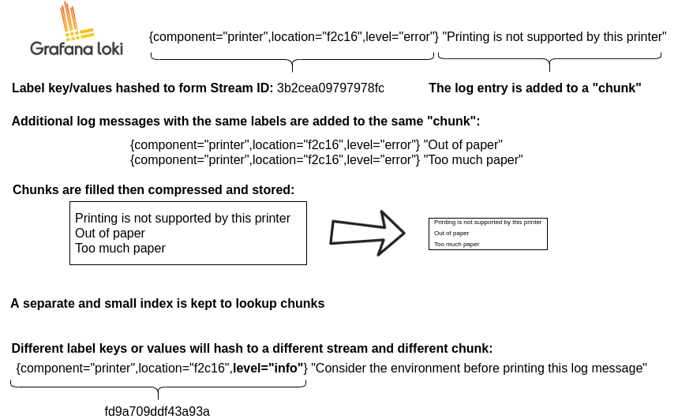
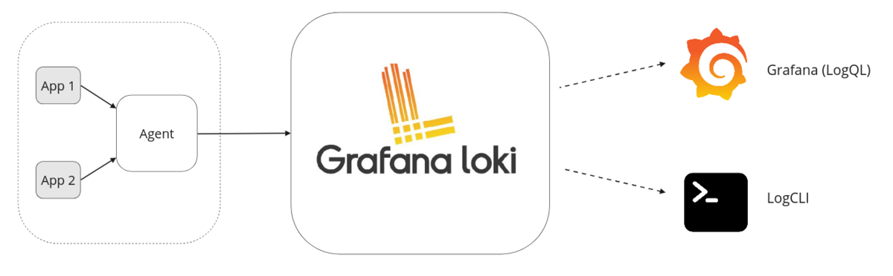
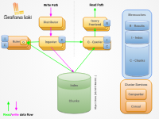

# Loki Overview

## What is Loki?

Loki 屬於 Grafana Labs 的開發項目，所以能直接支援 Grafana，且比起 EFK、ELK 等其他 log 系統，Loki 更為輕輛，因此適合用在規模較小的 cluster 中。

Loki 只收集 log 的 metadata 並做成 index (timestamp + label)，而非 index 整個 log 的內容，這樣可以節省大量的儲存空間，且查詢時也可以透過 Label，讀取效能更快。

一組擁有相同 Label 的 log 稱為 **log stream**，log data 會被壓縮並儲存，被儲存的 log data 稱為 **chunk**。

> 不同 label 的 log data 所存放的 chunk 也不同。

### Loki logging stack

要完成「Loki 收集 log 的功能 --> Grafana 供使用者查詢」的過程，需要以下幾個元件：

* Agent ：負責收集 log，並將多個 log 加上標籤做成 stream，再把 stream 推送給 Loki。常見的 Agent 如 Grafana Alloy、Promtail。

* Loki ：負責接收 log stream，並將 log data 壓縮儲存到 Object Storage 中。

* Grafana ：提供使用者查詢 log 的介面。使用者可以用 `LogQL` 語言查詢 log。

### Loki architecture

> Offical document: (https://grafana.com/docs/loki/latest/get-started/architecture/)

## PLG stack

若要監控 Kubernetes cluster 的 log，可以使用 **Promtail + Loki + Grafana** 這個組合：

* Promtail：以 DaemonSet 形式部署在每個 Node 上，負責收集 log 並送到 Loki。

* Loki：負責接收 log

* Grafana：提供使用者查詢、觀察 log 的 UI。

https://www.reddit.com/r/grafana/comments/15e9aej/help_setting_up_grafana_prometheus_and_loki_stack/

https://www.civo.com/learn/advanced-kubernetes-monitoring

https://www.youtube.com/watch?v=Mn2YpMJaEBY&t=466s