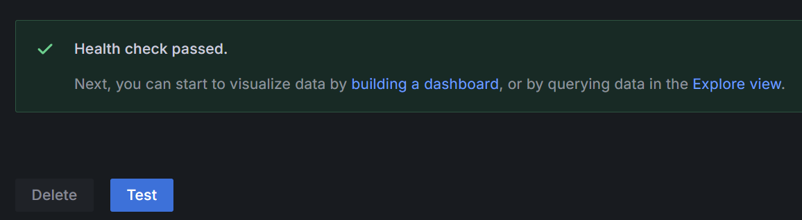

# Install kube-prometheus-stack + Loki

以下會安裝 Montoring 的幾種工具，這裡簡單介紹一下：

* Kube-prometheus-stack：包含 Prometheus、各類 exporter、Grafana 等關於「**Metrics**」的監控工具。

* Loki：安裝 Loki、Promtail 等關於「**Logs**」的監控工具。

只要將資料來源設定好，之後就可以統一用 Grafana 來觀察 Metrics 與 Logs。

---

#### Step 1：準備需要的 Namespace (Optional)

```bash
test "$(kubectl get ns monitoring 2> /dev/null)" || kubectl create ns monitoring
```

#### Step 2：準備需要的 values.yaml

```bash
# values for kube-prometheus-stack
cat <<EOF > ~/prom-values.yaml
grafana:
  adminPassword: Uj%c4fxF2xsXL*
  additionalDataSources:
    - name: Loki
      type: loki
      url: http://loki-loki-distributed-gateway.monitoring.svc.cluster.local
      access: proxy
  service:
    portName: web

prometheus:
  prometheusSpec:
    ruleSelectorNilUsesHelmValues: false
    ruleSelector: {}
    serviceMonitorSelectorNilUsesHelmValues: false
    serviceMonitorSelector: {}
    serviceMonitorNamespaceSelector: {}
    podMonitorSelectorNilUsesHelmValues: false
    podMonitorSelector: {}
    podMonitorNamespaceSelector: {}
    probeSelectorNilUsesHelmValues: false
    probeSelector: {}
    probeNamespaceSelector: {}
    scrapeConfigSelectorNilUsesHelmValues: false
    scrapeConfigSelector: {}
    scrapeConfigNamespaceSelector: {}
EOF
```

```bash
# values for promtail
cat <<EOF > ~/promtail-values.yaml
config:
  clients:
    - url: http://loki-loki-distributed-gateway.monitoring.svc.cluster.local/loki/api/v1/push
EOF
```


#### Step 3：安裝 kube-prometheus-stack


* 加入所需的 Helm Repo：

```
helm repo add prometheus-community https://prometheus-community.github.io/helm-charts
helm repo update
```


* 安裝 kube-prometheus-stack：

```
helm upgrade --install -f ~/prom-values.yaml prom prometheus-community/kube-prometheus-stack -n monitoring
```

#### Step 4：Expose Grafana

以下有兩個選擇來 expose Grafana：

* Option 1：LoadBalancer
```bash
kubectl -n monitoring edit svc prom-grafana
```
> Change `type: ClusterIP` to `type: LoadBalancer` & `port: 80` to `port: 3001`


* Option 2：port-forward

```bash
kubectl -n monitoring port-forward svc/prom-grafana 3001:80
```

#### Step 5：安裝 Loki & Promtail

* 加入所需的 Helm Repo：

```bash
helm repo add grafana https://grafana.github.io/helm-charts
helm repo update
```

* 安裝 Promtail：

```bash
helm upgrade --install -f ~/promtail-values.yaml promtail grafana/promtail -n monitoring
```

* 安裝 Loki：
```
helm upgrade --install loki grafana/loki-distributed -n monitoring
```

#### Final Step：登入 Grafana

登入 Grafana，確認 Data Source 設定是能正確連線：

> 若剛剛使用 LoadBalancer，可以透過瀏覽器連線到 `http://<EXTERNAL-IP>:3001`

> 若使用 port-forward，則透過瀏覽器連線到 `http://localhost:3001`

* Username：

```bash
kubectl get secret prom-grafana -n monitoring -o jsonpath="{.data.admin-user}" | base64 --decode ; echo
```

* Password：

```bash
kubectl get secret prom-grafana -n monitoring -o jsonpath="{.data.admin-password}" | base64 --decode ; echo
```


* 左邊 sidebar 選擇 `Connection` -> `Data Sources`，進入三個 Data Source 並選擇下方的 `Test`：

> 應該要看到「Health check passed」：




ref:

https://medium.com/israeli-tech-radar/how-to-create-a-monitoring-stack-using-kube-prometheus-stack-part-1-eff8bf7ba9a9