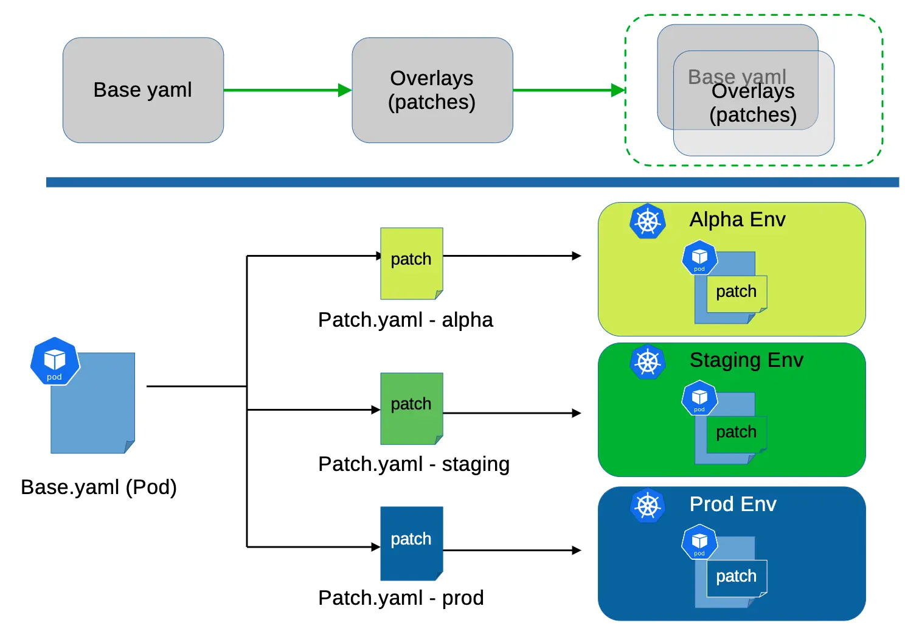

# kustomize

## 




## Try it out

The project structure is as follows:

```plaintext
kustomize-demo
├── base
│   ├── backend
│   │   ├── base-back.yml
│   │   ├── kustomization.yml --> resources: base-back.yml
│   └── frontend
│       ├── base-front.yml
│       └── kustomization.yml --> resources: base-front.yml
└── overlays
    ├── dev
    │   └── kustomization.yml
    └── prod
        └── kustomization.yml
```

Our goal：

```plaintext
prod-env：
    namespace: prod
    frontend-deployment：4 replicas, image: nginx:latest, name: prod-front
    backend-deployment：4 replicas, image: redis, name: prod-back

dev-env：
    namespace: dev
    frontend-deployment：1 replicas, image: nginx:1.26.3, name: dev-front
    backend-deployment：1 replicas, image: redis, name: dev-back
```

* create a new directory

```bash
mkdir -p kustomize-demo
cd kustomize-demo
```

* create the basic kustomize structure
```bash
mkdir -p base/frontend && mkdir -p base/backend
mkdir -p overlays/prod && mkdir -p overlays/dev
```
> base: contains the base resources, here we have two different applications and two different environments

> overlays: contains the overlays yaml files


* create a deployment and a service yaml as base resources

```bash
kubectl create deployment frontend --image=nginx --dry-run=client -o yaml > base/frontend/base-front.yml
kubectl create deployment backend --image=redis --dry-run=client -o yaml > base/backend/base-back.yml
```

* create a kustomization file for each application

```bash
vim base/frontend/kustomization.yml
```

```yaml
apiVersion: kustomize.config.k8s.io/v1beta1
kind: Kustomization

resources: # here you can add template yaml or other kustomization files
- base-front.yml # template yaml must be in the same directory with kustomization file
# if you have other kustomization files, you can add them here(relative path)
```

```bash
cp base/frontend/kustomization.yml base/backend/kustomization.yml
sed -i 's/base-front.yml/base-back.yml/g' base/backend/kustomization.yml
```

* create the overlays for prod environment：

```bash
vim overlays/prod/kustomization.yml
```

```yaml
apiVersion: kustomize.config.k8s.io/v1beta1
kind: Kustomization

namespace: prod

resources: # include other kustomization files(relative path)
- ../../base/frontend
- ../../base/backend

replicas: 
- name: frontend
  count: 4
- name: backend
  count: 4

images:
- name: nginx
  newName: nginx # if you want to use other image, you can change it here
  newTag: latest # change the image tag here
```

* create the overlays for dev environment：

```bash
vim overlays/dev/kustomization.yml
```

```yaml
apiVersion: kustomize.config.k8s.io/v1beta1
kind: Kustomization

namespace: dev

resources:
- ../../base/frontend
- ../../base/backend

replicas:
- name: frontend
  count: 1
- name: backend
  count: 1

images:
- name: nginx
  newName: nginx
  newTag: 1.26.3
```

* test the kustomize for both environments：
```bash
kustomize build overlays/prod
kustomize build overlays/dev
```

* if everything is correct, you can apply the resources to the cluster
```bash
kubectl create ns prod
kubectl create ns dev
kustomize build overlays/prod | kubectl apply -f -
kustomize build overlays/dev | kubectl apply -f -
```

https://weii.dev/kustomize/

## to do

https://ithelp.ithome.com.tw/articles/10355999

helm with kustomize & argocd