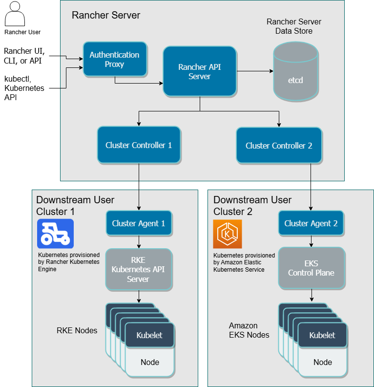

# Rancher

目前團隊有兩個 k8s cluster，一個在雲、另一個在地端，因此想架設一個 Rancher server，提供圖形化的介面來管理這兩個 k8s cluster。

## Overview

> 下圖為 rancher 2.x 版本之架構圖

* **任何**要給 Rancher 給控管的 custer 都必須安裝一個 Cluster Agent。

* 根據官方建議，生產環境下採用多節點(HA cluster)的方式去部署 Rancher Server。